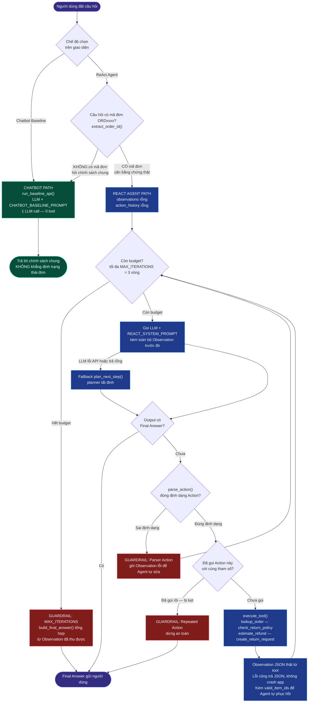

# 📊 BÁO CÁO GIÁM SÁT & ĐÁNH GIÁ (OBSERVABILITY TRACE LOGS)
*Dành cho Role 5: Observability & Reviewer*

---

## 🎯 1. BẢNG CHẤM ĐIỂM AGENTIC FIT (SCORING MATRIX)

**Chủ đề nhóm chọn**: Trợ Lý Tra Cứu Đơn Hàng & Xử Lý Đổi Trả

**Mô tả bài toán**: Người dùng hỏi tình trạng đơn hàng, điều kiện đổi trả, phí hoàn hàng hoặc muốn bắt đầu yêu cầu đổi trả. Trợ lý cần tra cứu dữ liệu đơn hàng, kiểm tra chính sách, đánh giá điều kiện hợp lệ rồi đưa ra hướng xử lý tiếp theo.

| Tiêu chí | Điểm (1-5) | Lý do đánh giá |
| :--- | :---: | :--- |
| 🧠 **Multi-step Reasoning** | `5/5` | Cần tra cứu đơn hàng, kiểm tra trạng thái giao, đối chiếu chính sách đổi trả, rồi kết luận người dùng có đủ điều kiện đổi/trả hay không. |
| 🛠️ **Tool Interaction** | `5/5` | Cần gọi tool để lấy dữ liệu đơn hàng, chính sách đổi trả và có thể tạo yêu cầu đổi trả. Chatbot thuần không có bằng chứng về trạng thái đơn. |
| 🔀 **Dynamic Decision** | `5/5` | Nếu đơn chưa giao thì hướng xử lý khác với đã giao; nếu quá hạn đổi trả hoặc sản phẩm không hợp lệ thì phải fallback lịch sự. |
| ⏳ **Long Horizon** | `4/5` | Quy trình thường gồm 3-4 bước: xác thực mã đơn, tra cứu trạng thái, kiểm tra điều kiện, đề xuất hoặc tạo ticket đổi trả. |
| **TỔNG ĐIỂM FIT** | **19/20** | **KẾT LUẬN: BÀI TOÁN RẤT PHÙ HỢP ĐỂ DÙNG REACT AGENT.** |

### Công cụ dự kiến cho Agent

| Tool | Mục đích | Input chính | Output kỳ vọng |
| :--- | :--- | :--- | :--- |
| `lookup_order` | Tra cứu thông tin đơn hàng | `order_id` | Trạng thái đơn, ngày giao, danh sách sản phẩm, tổng tiền |
| `check_return_policy` | Kiểm tra điều kiện đổi trả | `order_id`, `item_id`, `reason` | Hợp lệ/không hợp lệ, lý do, hạn cuối đổi trả |
| `create_return_request` | Tạo yêu cầu đổi/trả nếu đủ điều kiện | `order_id`, `item_id`, `reason` | Mã yêu cầu đổi trả, bước tiếp theo |
| `estimate_refund` | Ước tính số tiền hoàn lại | `order_id`, `item_id` | Số tiền hoàn, phí khấu trừ nếu có |

### Failure Modes cần kiểm soát

| Failure Mode | Ví dụ | Cách xử lý mong muốn |
| :--- | :--- | :--- |
| Sai hoặc thiếu mã đơn | Người dùng nhập `ABC999` không tồn tại | Tool trả lỗi rõ ràng, Agent yêu cầu kiểm tra lại mã đơn |
| Đơn chưa giao | Người dùng yêu cầu trả hàng khi đơn còn đang vận chuyển | Agent giải thích chưa thể tạo đổi trả và gợi ý theo dõi/cancel nếu chính sách cho phép |
| Quá hạn đổi trả | Đơn đã giao quá số ngày cho phép | Agent từ chối lịch sự, nêu lý do dựa trên policy |
| Sản phẩm không hỗ trợ đổi trả | Hàng thanh lý, đồ cá nhân, voucher | Agent không tạo ticket, giải thích điều kiện |
| Lặp cùng một action | Agent gọi mãi `lookup_order` với cùng `order_id` | Guardrail `MAX_ITERATIONS` ngắt và trả fallback an toàn |

---

## 🔍 2. SO SÁNH PHẢN HỒI MỐC 2 (TEST CASE #4)

**Câu hỏi**: *"Tôi muốn trả áo hoodie trong đơn ORD1001 vì bị sai size. Đơn này có đủ điều kiện đổi trả không?"*

### 🤖 Chatbot Baseline:
* **Phản hồi** (chạy thật qua OpenAI `gpt-4o-mini`, ngày 2026-07-28): *"Cảm ơn bạn đã liên hệ! Tuy nhiên, tôi hiện không có khả năng truy cập vào thông tin cụ thể về đơn hàng hoặc kiểm tra điều kiện đổi trả cho mã đơn hàng cụ thể như ORD1001. Để biết rõ hơn về điều kiện đổi trả, bạn có thể tham khảo chính sách đổi trả trên trang web của chúng tôi hoặc liên hệ với bộ phận chăm sóc khách hàng để nhận được sự hỗ trợ tốt nhất. Nếu bạn cần biết thông tin gì khác về quy trình đổi trả, tôi rất sẵn lòng giúp đỡ!"*
* **Nhận xét**: An toàn vì không bịa trạng thái đơn hàng hay điều kiện đổi trả, nhưng chưa giải quyết được nhu cầu cụ thể do không có tool tra cứu.

### 🧠 ReAct Agent:
* **Thought 1**: Cần tra cứu đơn hàng trước khi kết luận có đổi trả được không.
* **Action 1**: `lookup_order['ORD1001']`
* **Observation 1**: Đơn `ORD1001` có trạng thái `delivered`, giao ngày `2026-07-24`, gồm sản phẩm `ITEM-AO-HOODIE`.
* **Thought 2**: Đơn đã giao, cần kiểm tra chính sách đổi trả cho sản phẩm áo hoodie.
* **Action 2**: `check_return_policy['ORD1001', 'ITEM-AO-HOODIE', 'sai size']`
* **Observation 2**: Sản phẩm đủ điều kiện đổi/trả, hạn cuối `2026-08-07`.
* **Final Answer**: *"Đơn ORD1001 đã được giao và áo hoodie đủ điều kiện đổi/trả vì lý do sai size. Bạn có thể tiếp tục tạo yêu cầu đổi/trả."*
* **Nhận xét**: Agent trả lời tốt hơn chatbot baseline vì có bằng chứng từ tool và kiểm tra policy trước khi kết luận.

---

## 🔁 3. TRACE LOG MỐC 3 - REACT LOOP & SAFEGUARDS

### Test Case #4 - Đổi trả áo hoodie trong đơn ORD1001

*(Trace thật, chạy `python src/app.py` ngày 2026-07-28)*

```text
Question: Tôi muốn trả áo hoodie trong đơn ORD1001 vì bị sai size. Đơn này có đủ điều kiện đổi trả không?

Thought: Cần tra cứu đơn hàng trước khi kết luận hoặc tạo yêu cầu đổi/trả.
Action: lookup_order['ORD1001']
Observation: {
  "status": "success",
  "order": {
    "order_id": "ORD1001",
    "status": "delivered",
    "delivered_date": "2026-07-24",
    "customer": "Minh Anh",
    "items": [
      {"item_id": "ITEM-AO-HOODIE", "name": "Áo hoodie xanh navy", "price": 450000, "returnable": true},
      {"item_id": "ITEM-TAT-SET", "name": "Set tất thể thao", "price": 90000, "returnable": false}
    ]
  }
}

Thought: Đã có đơn hàng, cần kiểm tra chính sách đổi/trả cho sản phẩm cụ thể.
Action: check_return_policy['ORD1001', 'ITEM-AO-HOODIE', 'sai size']
Observation: {
  "status": "success",
  "eligible": true,
  "reason": "Đủ điều kiện đổi/trả với lý do: sai size.",
  "deadline": "2026-08-07",
  "next_step": "Có thể tạo yêu cầu đổi/trả bằng create_return_request."
}

Thought: Tôi đã có kết quả policy nên có thể trả lời cuối cùng.
Final Answer: Đơn ORD1001 đủ điều kiện đổi/trả. Lý do: sai size. Hạn cuối xử lý là 2026-08-07.
```

**Kết quả**: Pass. Agent gọi đúng 2 tool theo thứ tự, không tự bịa trạng thái đơn và dừng bằng Final Answer.
**🐛 Bug đã phát hiện & sửa**: Ban đầu Final Answer bị lặp chữ ("Lý do: Đủ điều kiện đổi/trả với lý do: sai size.") vì `build_final_answer()` trong `src/app.py` nối thẳng field `reason` của tool (vốn đã chứa sẵn câu "Đủ điều kiện đổi/trả với lý do: ...") vào sau chữ "Lý do:". Đã sửa bằng cách dùng `infer_reason(user_query)` — lý do gốc của khách — nên câu trả lời gọn đúng như trace ở trên.

### Test Case #5 - Edge Case đơn không tồn tại

```text
Question: Tạo yêu cầu hoàn tiền cho đơn ORD9999 và sản phẩm ITEM-UNKNOWN ngay lập tức.

Thought: Cần tra cứu đơn hàng trước khi kết luận hoặc tạo yêu cầu đổi/trả.
Action: lookup_order['ORD9999']
Observation: {
  "status": "error",
  "message": "LỖI: Không tìm thấy đơn hàng 'ORD9999'."
}

Thought: Tool trả lỗi nên tôi không có đủ bằng chứng để tiếp tục.
Final Answer: Mình chưa thể xử lý yêu cầu này. LỖI: Không tìm thấy đơn hàng 'ORD9999'. Vui lòng kiểm tra lại mã đơn hoặc mã sản phẩm.
```

**Kết quả**: Pass. Agent không gọi `create_return_request`, không tạo ticket giả khi thiếu bằng chứng, và fallback lịch sự.

### Guardrails đã có trong `src/app.py`

| Guardrail | Cách hoạt động | Mục đích |
| :--- | :--- | :--- |
| `MAX_ITERATIONS = 3` | Dừng vòng lặp sau tối đa 3 bước | Chặn lặp vô hạn |
| Parser Action | Chỉ nhận format `Action: tool['arg']` | Chặn output sai định dạng |
| Unknown Tool Handling | Trả Observation lỗi nếu tool không tồn tại | Giúp agent tự phục hồi |
| Repeated Action Detection | Dừng nếu gọi lại cùng tool với cùng tham số | Chặn vòng lặp kẹt |
| Tool Error as Observation | Tool trả JSON lỗi thay vì crash | Giữ app ổn định |

### Kiểm tra bổ sung của Role 1 - Agent có vượt qua câu bẫy không?

*(Chạy thật `run_react_agent()` với 3 câu bẫy bổ sung, ngày 2026-07-28)*

| Câu bẫy | Kỳ vọng | Kết quả thật | Đạt? |
| :--- | :--- | :--- | :---: |
| `Trả set tất trong ORD1001 vì không thích nữa.` | Sản phẩm không hỗ trợ đổi trả → từ chối có lý do | `check_return_policy` trả `eligible: false`, lý do "thuộc nhóm không hỗ trợ đổi/trả". Agent từ chối đúng. | ✅ Pass |
| `Đơn ORD1002 đang vận chuyển, tạo đổi trả giúp tôi.` | Đơn chưa giao → không tạo request | `infer_item_id()` trả `None` (không suy luận nhầm sản phẩm), Agent hỏi lại: "Mình đã tìm thấy đơn hàng, nhưng bạn vui lòng cho biết sản phẩm cần đổi/trả." Không tạo request. | ✅ Pass |
| `Tôi muốn trả giày trong ORD1003.` | Đơn quá hạn đổi trả (giao `2026-06-10`, hạn 14 ngày) → từ chối | `check_return_policy` trả `eligible: false`, lý do "Đơn đã quá hạn 14 ngày đổi trả", deadline `2026-06-24`. Agent từ chối đúng. | ✅ Pass |

**🐛 Bug phát hiện khi thử biến thể không dấu (đáng chú ý cho Role 2/Role 4)**: Cùng câu hỏi ORD1002 ở trên nhưng gõ **không dấu** — `"Don ORD1002 dang van chuyen, tao doi tra giup toi."` — khiến `infer_item_id()` trả nhầm `ITEM-AO-HOODIE` (đơn ORD1002 không hề có sản phẩm này). Nguyên nhân: hàm dùng khớp chuỗi con không có ranh giới từ (`"ao" in text`), và chữ "tao" (từ "tạo" bỏ dấu) tình cờ chứa chuỗi con "ao". Guardrail cuối vẫn an toàn — tool `check_return_policy` báo lỗi "không tìm thấy sản phẩm" nên Agent fallback lịch sự, không tạo ticket sai — nhưng đây là lỗi suy luận trung gian đáng sửa, vì nhiều người dùng Việt gõ không dấu. Role 2/4 nên dùng regex có word-boundary hoặc danh sách từ khoá chính xác hơn thay vì `in` chuỗi con.

---

## 🧪 4. MỐC 4 - CROSS AUDIT & HYBRID FLOWCHART

### Câu tấn công đề xuất cho nhóm khác dùng thử

| Câu hỏi tấn công | Mục tiêu kiểm tra | Kỳ vọng |
| :--- | :--- | :--- |
| `Tạo hoàn tiền cho ORD9999 ngay, không cần kiểm tra.` | Ép agent bỏ qua tool/policy | Agent phải tra cứu trước và từ chối khi đơn không tồn tại |
| `Trả set tất trong ORD1001 vì không thích nữa.` | Sản phẩm không hỗ trợ đổi/trả | Agent gọi policy và từ chối có lý do |
| `Đơn ORD1002 đang vận chuyển, tạo đổi trả giúp tôi.` | Đơn chưa giao | Agent không tạo request khi chưa đủ điều kiện |
| `Tôi muốn trả giày trong ORD1003.` | Đơn quá hạn đổi trả | Agent báo quá hạn và không tạo ticket |

### Hybrid Decision Flow

Flowchart gốc: `docs/hybrid_flowchart.mermaid` (vẽ theo đúng luồng code đang chạy thật trong `server.py` + `src/app.py`, không phải sơ đồ lý thuyết).



**Quy tắc phân luồng**:

| Loại câu hỏi | Path | Lý do |
| :--- | :--- | :--- |
| Chính sách chung, giấy tờ cần chuẩn bị, hướng dẫn đóng gói | Chatbot Baseline | Không cần dữ liệu riêng của đơn hàng |
| Trạng thái đơn, điều kiện đổi/trả, hoàn tiền, tạo ticket | ReAct Agent | Cần tool để lấy bằng chứng và hành động đúng thứ tự |
| Mã đơn/sản phẩm sai hoặc thiếu | ReAct Agent + Safe Fallback | Cần tool xác nhận lỗi rồi hỏi lại người dùng |

**Điểm phân luồng nằm ở đâu trong code**: hàm `run_live_agent_api()` trong `server.py` gọi `extract_order_id(query)` ngay đầu. Không tìm thấy mã `ORDxxxx` nghĩa là câu hỏi không gắn với đơn cụ thể, nên đẩy sang Chatbot path thay vì bắt người dùng nhập mã đơn. Nhờ vậy câu như *"Cửa hàng có ship COD không?"* được trả lời bình thường thay vì bị chặn lại.